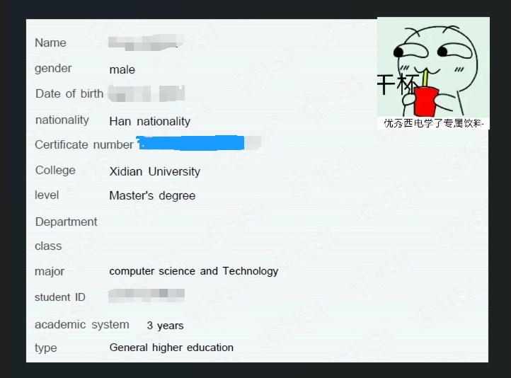

> 本教程适用于2024年之后的Github学生认证申请，因为现在的认证流程改变了很多，所以重新进行了总结这方面的指南。

# 验证教育邮箱

进入[Email settings](https://github.com/settings/emails)，找到`Add email address`添加教育邮箱<u>并验证</u>。

> 注意点：`Add email address`这个输入框不给粘贴，只能**手动输入**！

# 修改个人资料

进入[Your profile](https://github.com/settings/profile)

- 修改`Name`:你的名字拼音，例如你叫张小三，建议格式为`Sanxiao Zhang`。
- 修改`Company`为你的学校英文名。
- **不用修改头像！不用修改头像！**

# 制作认证文件

- 进入[学信档案](https://my.chsi.com.cn/archive/bab/xj/show.action)生成教育部学籍在线验证报告。

- 直接下载PDF，别用浏览器的翻译了。
- 进入[谷歌翻译](https://translate.google.com/)，把下载好的PDF扔进文档翻译并下载。
- 使用PDF编辑工具，例如我使用`Adobe Acrobat DC`编辑，为什么还要编辑PDF呢，是因为谷歌翻译之后的字体太小了，用工具把字体大小放大。
- 当你觉得字体大小差不多的时候，用截图工具进行裁剪
  - 裁剪大小：`653×485`差不多就好了，不要太大了。
  - 裁剪范围见下图，表情包是头像位置哈。
  

# 图片转换Base64

随便百度一个，例如[不知道有没有挂的网站](https://www.sojson.com/image2base64.html)，把图片转换成base64，复制好转换后的base64编码。

> 为什么要这步呢？因为现在Github不支持拖入、上传图片了，我想到一个偷渡的办法，那就是先拍照，然后在开发者工具找到这个``，直接把复制的base64给替换上面，这也为什么上面让大家裁剪差不多大小的图片，不然识别不了。学生认证采用的是智能识别。

> 发现有些人可能不会使用浏览器的开发者工具。
> 法一：鼠标移动到照片位置右键，像Edge、chrome浏览器右键会有**检查**,此时点击检查会直接跳转到照片所存储的img标签，把src的值更改成自己的即可
> 法二：先打开开发者工具，然后鼠标点击开发者工具左上角的箭头(`ctrl+shift+c`),然后再把鼠标移动到所拍的照片，也能找到img所存储的地方
> 

**下面，请你连接校园网，请你关闭任何的VPN及其浏览器扩展！**识别的时候还会检测你的位置，所以别有VPN存在。

# 提交验证

直连，学校地址访问[Github Benefits](https://education.github.com/discount_requests/application)，`Select your academic status is Student`

只要第一步你的教育邮箱验证了，一直拖到底部，就能直接Continue了，有些学校的邮箱可能识别不了，所以还得手动输入学校的英文名了。

下一步之后就会来到拍照界面，跟前面说的一样，先简单拍照，然后换Base64大法。

现在的界面已经没有以前那些证件类型的选择，识别很智能了。

当你图片替换好了之后，只要你替换好的图片刚好在他的框框内，你就可以点提交了。

提交的时候会卡十几秒，然后就有进度条在识别了。

如果有问题，八成就是你的图片截图太大了，或者图片不清楚，或者IP地址

如果没有问题，那么你会看到

`Congrats! Your request for * was approved and your benefits will be available soon.`

这种情况的意思是说，你验证成功了，但提交的人数太多了，所以你需要等待几天(3-几个月不等)。

> 后续：我在4.10申请，4.13通过。
